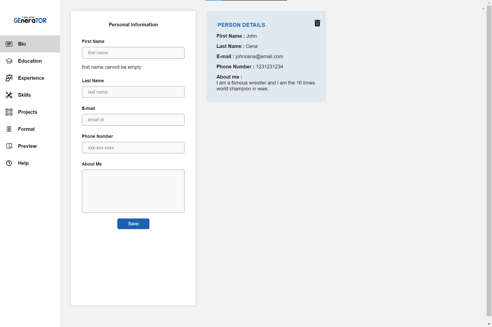
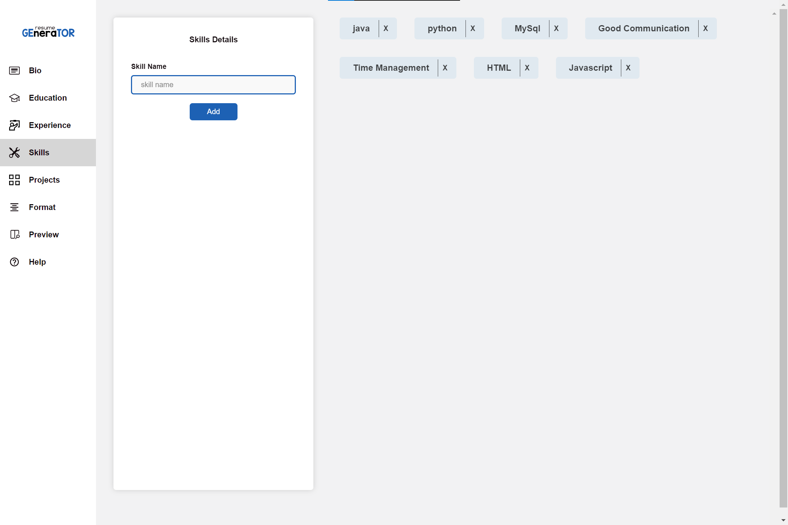
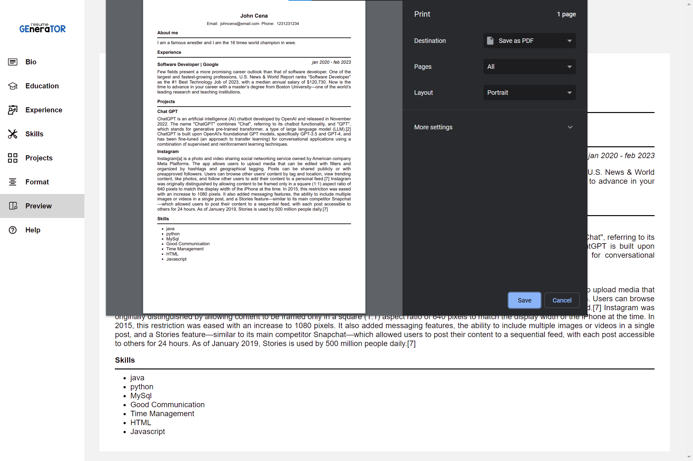

# RESUME GENERATOR

<p align="center"></p>

This web application is used to generate and download the resume for user after he/she fills the details in the forms. This application is best for the one who need resume in short time or to the one who don't have idea of creating. I developed this application while I am learning the concepts of state management in `react` using the `redux-toolkit`.

🚀[CLICK HERE](https://iammadhanmohan.github.io/resume-generator/) to visit the site or copy the below link

🔗[https://iammadhanmohan.github.io/resume-generator/](https://iammadhanmohan.github.io/resume-generator/)

## 🔨Tools & Technologies

---

- HTML
- CSS
- React
- Redux-Toolkit
- React-Redux
- React-Icons
- React-to-print
- GitHub-pages

## ⛳Features

---

- Application is _responive_ for all type of screens.
- User can perform _CRUD operations_ on form data.
- User can download the resume in PDF Format. (_converting components to A4 size paper_)
- User's Friendly.

## Installation steps

---

Want to try in your local system? then follow the below steps.

1. Download the project in zip format.
1. Unzip the file in your local system.
1. Open the folder in VS code terminal or command prompt.
1. Download the dependencies by running the below command.

```
npm install
```

> Note : Make sure your local system have Node before running above command.

5. After installing Dependencies run the below command to start the application.

```
npm start
```

## Screenshots

---

Some of the screenshots of this application is attached below.

<p align="center"></p>
<p align="center"></p>
<p align="center"></p>

## Thank you for checking

---

#### Give a 🌟Star if you like my project.

#### Comment📝 your issues or 🐞bug or any 👀suggestions in issue tab.
